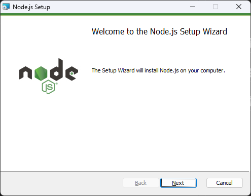
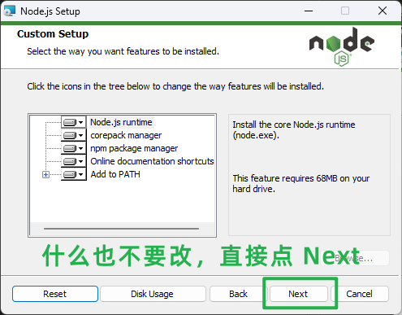
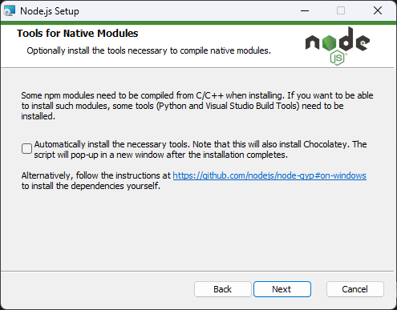
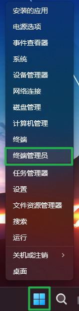

# 贡献指南

> 别被字数吓到，按着流程走就可以了。  
> 如果你已经很熟悉前端开发了，直接跳到 [配置 Node.js](#配置-nodejs) 开始看。

## 安装 Node.js (Windows 环境下)

> 安装 Node.js 部分仅适用于 Windows 系统，但是如果你使用 Linux/Mac OS，那么我觉得你应该能自己解决。

1. 安装 Node.js v22 或更新的版本，你可以打开[这个链接](https://mirrors.ustc.edu.cn/node/latest/)之后点击名字类似 `node-v**.*.*-x64.msi` 的链接下载最新版本的 Node.js
2. 下载完成之后，打开下载下来的文件。稍等一会安装程序初始化，如果一切顺利，那么你应该会看到如下界面。请点击 `Next` 按钮。

    

3. 请勾选 `I accept the terms in the License Agreement` 同意用户协议之后按下 `Next` 按钮继续安装。

   

4. 到了选择安装路径界面，**不要修改安装路径！不要修改安装路径！不要修改安装路径！**。直接点击 `Next` 按钮。

    

5. 请直接点击 `Next` 按钮，**不要修改该界面上的任何选项！不要修改该界面上的任何选项！不要修改该界面上的任何选项！**

    

6. 同上，请直接点击 `Next` 按钮，**不要修改该界面上的任何选项！不要修改该界面上的任何选项！不要修改该界面上的任何选项！**

    

7. 直接点击 `Install` 按钮。

    

8. 点击 `Finish` 按钮完成安装。

    

## 配置 Node.js

> Linux/MacOS 用户请打开终端输入 `corepack enable`，如果你碰到了权限错误请在指令前加个 `sudo`。

1. 以管理员身份打开终端 (右键开始菜单按钮 (就是你平常开关机按的第一个按钮)，在弹出的菜单选择 `终端管理员` 或 `Windows PowerShell (管理员)`)

     

2. 在弹出窗口输入 `corepack enable` 并按下回车 (注：你弹出的窗口可能和截图不一样，这是正常现象，正常操作即可)

    

## 初始化项目

## 调试