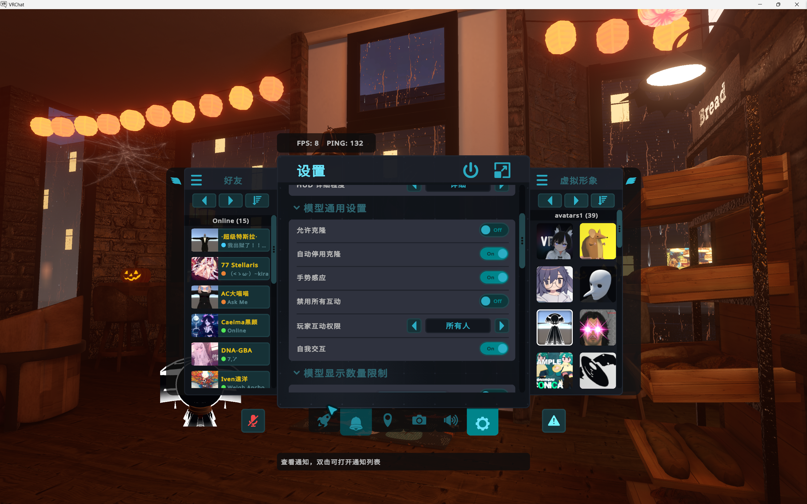
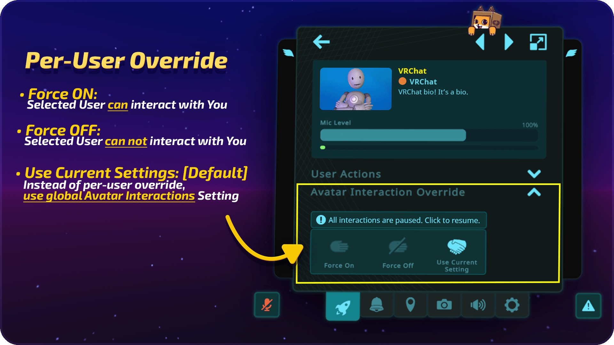
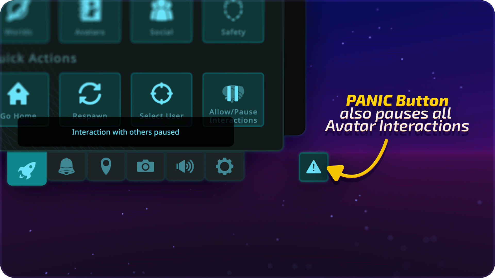

# 虚拟形象互动权限和设置

::: warning 🧑‍💻译者警告
当前版本文档内容落后于当前版本应用状态，我们会将当前版本应用状态以引用形式编写进本文档中，同时保留当前版本文档内容。
:::

在快捷菜单的“设置”选项卡下，您可以选择谁能够与您的虚拟形象进行互动。

为了使某人能够与您的虚拟形象互动，**双方必须在快捷菜单中允许其他人的对自己虚拟形象的互动**。

使用“了解更多”按钮可以随时查看完整指南。

您可以在快捷导航最右侧的设置卡中找到虚拟形象互动设置，该选项卡是一个齿轮图标。

**玩家互动权限** - 指定您允许谁与您进行互动。您可以在“好友”，“所有人”和“关闭”之间进行选择。系统默认为“好友”。
**允许/暂停互动** - 这将全局打开或关闭所有互动，无论您的设置如何。
**自我交互** - 切换与您自己的虚拟形象的互动。

您可以随时单击“了解更多”以查看包含说明的弹出窗口。

::: warning 🧑‍💻译者核对-1
目前快捷导航的设置界面和当今文档的演示界面有着极大的差异，我们将附图做出解释。 
“了解更多”按钮已被取消。

:::

名牌上方的如下图标显示您看到的所有用户的权限状态。

如果手牌显示为灰色，则表示该用户不允许您与其进行互动。如果它亮起，则表示该用户启用了互动。

您可以通过单击用户来覆盖用户的设置，就像每个用户虚拟形象显示系统一样。更改会实时保存。

您还可以使用快速菜单上的暂停按钮立即全局暂停所有互动。

最后，点击“**PANIC（三角标）**”按钮除了会将您的安全系统护盾设置更改为最高级别外，还将暂停所有互动。
